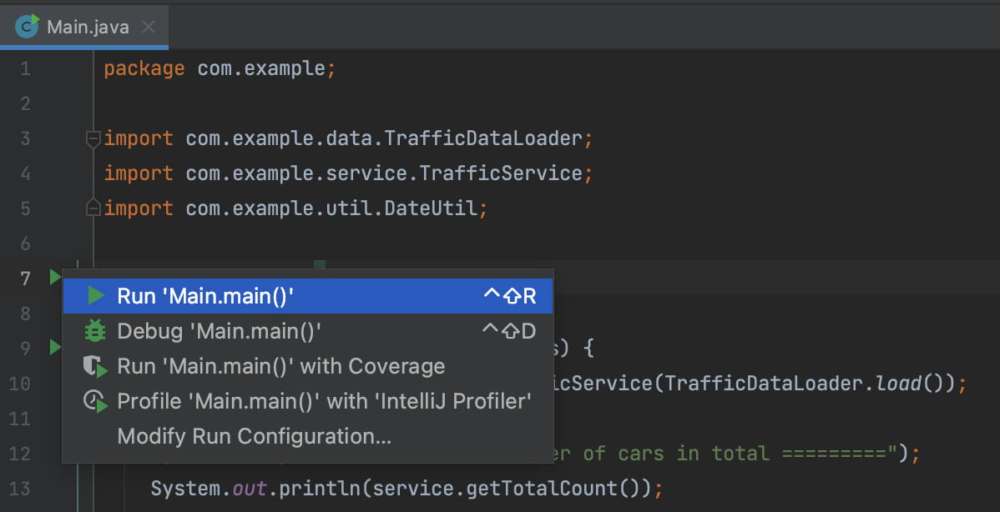

## System Requirements
- JDK 17 (Java 17.0.2)
- Gradle 7.4
- Recommended running in MacOS or Linux
- Recommended using Intellij IDEA CE
## Testing the solution
```
./gradlew test
```
## Running the solution
Run the main class from IDE:



Running it will make an output:

```
========= Number of cars in total =========
398

========= Number of cars by date =========
2021-12-01 179
2021-12-05 81
2021-12-08 134
2021-12-09 4

========= Top 3 hours with most cars =========
2021-12-01T07:30:00 46
2021-12-01T08:00:00 42
2021-12-08T18:00:00 33

========= 1.5 hours with least cars =========
2021-12-01T15:00:00 9
2021-12-01T15:30:00 11
2021-12-01T23:30:00 0
```